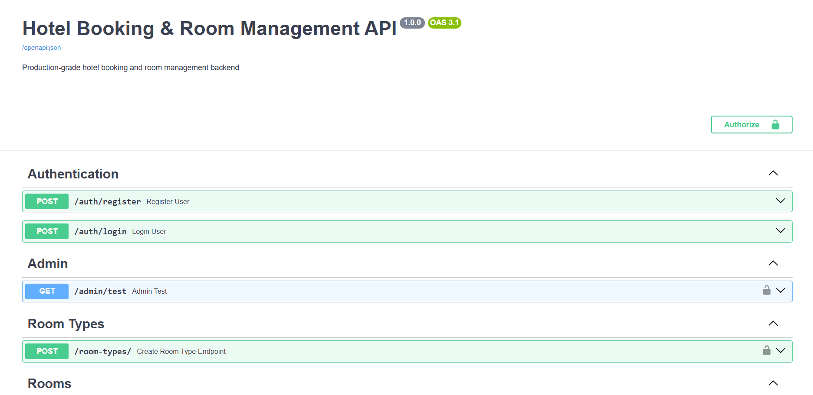
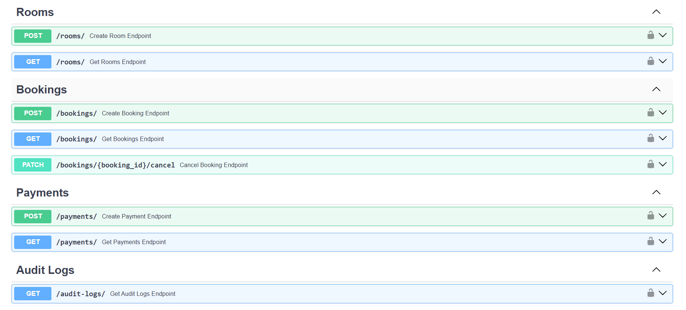

# Hotel Booking & Room Management API

A RESTful API built with **FastAPI, SQLAlchemy, and SQLite** for managing hotel rooms, room types, bookings, payments, users, and audit logs.

The project includes JWT authentication, role-based access control, database migrations, transaction safety, and automated tests.

## API Documentation

The application provides interactive API documentation through Swagger UI and ReDoc.

### Swagger UI Overview



### API Endpoints



Start the application locally and open:

- **Swagger UI:** [http://127.0.0.1:8000/docs](http://127.0.0.1:8000/docs)
- **ReDoc:** [http://127.0.0.1:8000/redoc](http://127.0.0.1:8000/redoc)

## Features

- User registration and login with JWT authentication
- Password hashing using Passlib and bcrypt
- Role-based access control for administrative endpoints
- Room type creation and management
- Room creation, listing, filtering, pagination, and sorting
- Booking creation, listing, and cancellation
- Validation to prevent overlapping confirmed bookings for the same room
- Payment creation and payment history
- Decimal-based monetary fields for room prices, booking totals, and payments
- Audit logging for booking and payment operations
- Transaction rollback when booking or payment audit logging fails
- Validation of role assignments and duplicate role assignments
- SQLite database with SQLAlchemy ORM
- Database schema migrations using Alembic
- Interactive API documentation using Swagger UI and ReDoc
- Automated testing using pytest

## Technology Stack

| Technology | Purpose |
|---|---|
| Python | Backend programming language |
| FastAPI | REST API framework |
| SQLAlchemy | Database ORM |
| SQLite | Relational database |
| Alembic | Database migrations |
| Pydantic | Request validation and response schemas |
| JWT and OAuth2 | Authentication and token-based authorization |
| Passlib and bcrypt | Password hashing |
| pytest | Automated testing |
| Uvicorn | ASGI application server |

## Project Structure

```text
Hotel_Booking_API/
├── app/
│   ├── api/
│   │   └── routes/
│   │       ├── admin.py
│   │       ├── audit_logs.py
│   │       ├── auth.py
│   │       ├── bookings.py
│   │       ├── payments.py
│   │       ├── room_types.py
│   │       └── rooms.py
│   ├── core/
│   ├── db/
│   ├── models/
│   ├── schemas/
│   ├── services/
│   └── main.py
├── alembic/
│   └── versions/
├── tests/
├── screenshots/
├── .env
├── .gitignore
├── alembic.ini
├── requirements.txt
└── README.md
```

**Note:** The `.env` file is local configuration and should not be committed to version control. The structure above summarizes the main application directories and files.

## Setup and Installation

### Prerequisites

- Python 3.13 or a compatible Python version
- Git
- A terminal such as Windows PowerShell

### 1. Clone the repository

```powershell
git clone https://github.com/hemanthtangudu94-oss/hotel-booking-room-management-api.git
cd hotel-booking-room-management-api
```

### 2. Create and activate a virtual environment

On Windows PowerShell:

```powershell
python -m venv .venv
.\.venv\Scripts\Activate.ps1
```

### 3. Install dependencies

```powershell
python -m pip install -r requirements.txt
```

### 4. Configure environment variables

Create a `.env` file in the project root:

```dotenv
SECRET_KEY=replace_with_a_strong_random_secret
ALGORITHM=HS256
ACCESS_TOKEN_EXPIRE_MINUTES=30
```

Generate a strong, random secret key for your environment. Keep it private, and never commit `.env` or real credentials to a public repository.

The application uses `SECRET_KEY` for token signing. The other settings have defaults in the application configuration.

### 5. Apply database migrations

```powershell
alembic upgrade head
```

### 6. Start the API

```powershell
uvicorn app.main:app --reload
```

Open [http://127.0.0.1:8000/docs](http://127.0.0.1:8000/docs) to explore and test the endpoints.

## Running Tests

Run the complete automated test suite from the project root:

```powershell
pytest -v
```

**Latest verified test result:** 42 tests passed.

The test suite covers authentication, role-based access, room operations, booking operations, payment validation, audit logging, and transaction rollback scenarios.

## Authentication

1. Register a user using `POST /auth/register`.
2. Log in using `POST /auth/login`.
3. Submit the `username` and `password` fields using the OAuth2 form format.
4. Copy the returned access token.
5. In Swagger UI, click **Authorize** and authenticate using the configured OAuth2 password flow.
6. Call protected endpoints using an account with the appropriate permissions.

Administrative endpoints require the `ADMIN` role.

## API Endpoint Overview

| Area | Endpoint | Method |
|---|---|---|
| Authentication | `/auth/register` | POST |
| Authentication | `/auth/login` | POST |
| Administration | `/admin/test` | GET |
| Room types | `/room-types/` | POST |
| Rooms | `/rooms/` | POST |
| Rooms | `/rooms/` | GET |
| Bookings | `/bookings/` | POST |
| Bookings | `/bookings/` | GET |
| Bookings | `/bookings/{booking_id}/cancel` | PATCH |
| Payments | `/payments/` | POST |
| Payments | `/payments/` | GET |
| Audit logs | `/audit-logs/` | GET |

See Swagger UI for request schemas, query parameters, authentication requirements, and response formats.

## Reliability and Data Integrity

- Booking and payment operations validate business rules before committing changes.
- Monetary values use decimal-compatible database fields.
- Booking and payment audit records are written within the corresponding database transaction.
- Failed transactional operations roll back database changes.
- Room listing supports validated sorting, filtering, and pagination.
- Role assignment checks for missing users and duplicate assignments.

## Important Notes

- The default database configuration uses SQLite.
- Users can access their own bookings and payments, subject to the implemented authorization rules.
- Administrative operations require the appropriate role.
- The `.env` file, virtual environment, and local database files should not be committed to a public repository.
- This project is a backend API; a separate frontend is not included in the documented structure.
